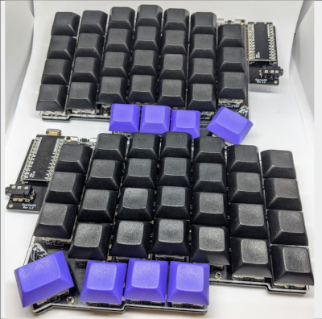
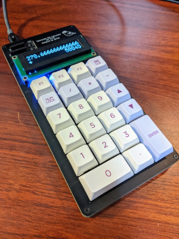
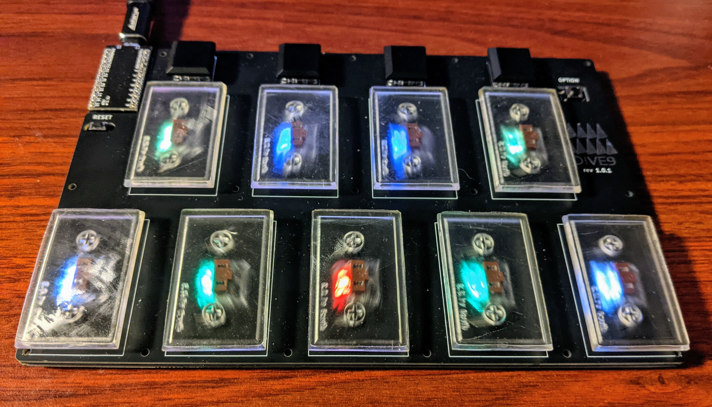

## Software Engineer ♡  VSCode,  Kubernetes,  Go,  Python

- <a href="https://twitter.com/74th">Twitter: @74th</a>
- <a href="https://github.com/74th">github: 74th</a>
- <a href="https://74th.tech">74th.tech Personal Site (Japanese)</a>
- <a href="https://74th.booth.pm/">shop 74th(tech fun Books and build-your-own Keyboard)</a>

## VS Code  Activity

### Extensions

- [High Contrast Icons](https://marketplace.visualstudio.com/items?itemName=74th.high-contrast-icons)
- [editing snippets with yaml](https://marketplace.visualstudio.com/items?itemName=74th.editing-snippets-with-yaml)
- [JSON YAML Schema Selector](https://marketplace.visualstudio.com/items?itemName=74th.json-yaml-schema-selector)
- [Monokai Charcoal high contrast](https://marketplace.visualstudio.com/items?itemName=74th.monokai-charcoal-high-contrast)
- [vim Style for VSCode](https://marketplace.visualstudio.com/items?itemName=74th.vimStyle)
- [NaturalContrast Theme with High contrast](https://marketplace.visualstudio.com/items?itemName=74th.Theme-NaturalContrast-With-HC)

### Developing

- [eBNF Parser for Language Server](https://github.com/74th/ls-ebnf-parser)
- [Visual Studio Code Debug Specs](https://vscode-debug-specs.github.io/)
- [VS Code TypeScript 開発体験 ハンズオン](https://github.com/74th/vscode-typescript-handson)
- [Hello VS Code ハンズオン](https://github.com/vscodejp/handson-hello-vscode)

### Books(Japanese)

- 📖2020-02 [『Visual Studio Code 実践ガイド』技術評論社](https://gihyo.jp/book/2020/978-4-297-11201-1)
- 📖2022-01 [『4 つのガジェット製作でえた電子工作の知識』技術書典 12](https://techbookfest.org/event/tbf12)
- 📖2021-07 [『VS Code デバッグ技術 第 2 版』技術書典 11](https://techbookfest.org/product/4548114826395648)
- 📖2020-09 [『VS Code Dev Container Guidebook』技術書典 9](https://74th.booth.pm/items/2425642)
- 📖2020-03 [『Visual Studio Code Ninja Guide』技術書典 8](https://74th.booth.pm/items/1973166)
- 📖2019-09 [『Visual Studio Code Remote Dev & Cloud Code Guide』技術書典 7](https://74th.booth.pm/items/1575560)
- 📖2018-12 [『Visual Studio Code デバッグ技術 (技術の泉シリーズ（NextPublishing）)』](https://booth.pm/ja/items/1314180)

## hobby developments

- [Sparrow24 BLE Calculator（Bluetooth テンキー兼電卓な自作キーボードキット）](https://74th.booth.pm/items/3338904)
- [Dive9 音楽ゲームコントローラ](https://booth.pm/ja/items/3168541)
- [Sparrow62 build-your-own Keyboard](https://booth.pm/ja/items/2525427)
- [High Contrast Icons](https://marketplace.visualstudio.com/items?itemName=74th.high-contrast-icons)
- [stdio tee logger](https://github.com/74th/stdio-tee-logger/)
- [xonsh direnv](https://github.com/74th/xonsh-direnv)
- [stime](https://github.com/74th/stime)

## tech books📖 and talks💬

### main

- 📖 2022-01『4 つのガジェット製作でえた電子工作の知識』[技術書典 12](https://techbookfest.org/event/tbf12)
  - [技術書典マーケット(PDF 販売中)](https://techbookfest.org/product/6237216143572992?productVariantID=4824943890006016)
  - 自作キーボードの製作をきっかけに電子工作の世界に入門し、最初は意味不明だったさまざまなことを、4 つのガジェットの製作を通じて電子工作について理解し習得しました。ガジェット製作にどのようなことを考えて取り組んだのか、またそこでえた知識をざっくりとまとめました。これから電子工作にふれてみたい方も、電子工作に心得のある方も、プロの方も、楽しくガジェットづくりをしているのが伝わればと思います。
- 💬 2021-11『PlatformIO で シュッと Arduino 開発を高速化しよう!(Speed up your Arduino development with PlatformIO!)』[VS Code Conference Japan 2021](https://vscodejp.github.io/conf2021/ja/)
  - 近年 Arduino を使った IoT 機器の開発が電子工作でもよく行われるようになりました かつての組み込みソフトウェアの開発では、マイコンベンダーが提供する IDE を使用するのが当たり前でした。 現在は、PlatformIO を使うことによって、組み込みソフトウェアの開発をシュッっと行ことができます。 PlatformIO は、 VS Code の拡張機能として、環境構築からビルド、アップロード、デバッグまでの一連のワークフローを提供してくれます。 本セッションでは、Arduino 開発で PlatformIO を使う場合、PlatformIO が何を担ってくれるのかを解説しながら、実際に VS Code でどのように開発ができるのかを説明していきます。
  - [Movie](https://youtu.be/AAVTnEa4vEs?t=2100)
  - [Slide](https://docs.google.com/presentation/d/e/2PACX-1vQCn-ntZLAU5FgdFp0nmC2Fn2PmQ1wjaFv3IQ16WNdsSFLCis7rM0FrtMSLTQteqRdj5CKpFz3agZEw/pub?start=false&loop=false&delayms=3000&slide=id.p)
- 📖 2021-07『VS Code デバッグ技術 第 2 版』[技術書典 11](https://techbookfest.org/event/tbf11)
  - [技術書典マーケット(PDF 販売中)](https://techbookfest.org/product/4548114826395648)
  - 技術書典 3 で頒布した『VS Code デバッグ技術』ですが、2021 年現在に語るべき VS Code のデバッグは大きく変化しました。VS Code 内にブラウザを開く拡張機能、リモート開発機能、Dev Container、Raspberry Pi Pico のでバッグなどなど。2021 年現在に最新化した 8 言語解説はありますが、多くのページ（92p）を「デバッグ応用技術編」として書き下ろしました。あまりデバッグに馴染みのない方への「デバッグ機能の基本編」も収録しています。 ぜひ VS Code で今できる最新のデバッグ技術をお楽しみください。
- 💬 2020-11『最強の Dev Container を考える』[VS Code Conference Japan](https://vscode.connpass.com/event/184441/)
  - [Movie(YouTube)](https://youtu.be/GqC5wQV2bG8?t=22111)
  - [Slide](https://docs.google.com/presentation/d/1uhZwQxoyQuV8fYxn0a0O--J7f0dwpJhccaIMS8w-rF8/edit?usp=sharing)
- 💬 2020-06『あらゆるエンジニアを支援！ VS Code Meetup の紹介とハンズオンで活躍するテクニック集』[de:code 2020](https://www.microsoft.com/ja-jp/events/decode/)
  - [session page](https://www.microsoft.com/ja-jp/events/decode/2020session/detail.aspx?sid=C02&tk=C)
  - [Movie(YouTube)](https://www.youtube.com/watch?v=1xkSfy-ylhU)
  - [Slide](https://www.slideshare.net/microsoftjp/decode-2020-vs-code-meetup)
- 📖 2020-02 『Visual Studio Code 実践ガイド』技術評論社
  - VSCode の全機能の解説、TypeScript/Go/Python での実践的な開発方法、拡張機能開発から LSP の解説まで扱った実践ガイド
  - [技術評論社サイト](https://gihyo.jp/book/2020/978-4-297-11201-1)
  - [書評](vscode-book-review/)
- 📖 2018-12 商業誌『Visual Studio Code デバッグ技術 (技術の泉シリーズ（NextPublishing）)』インプレス R&D
  - VSCode のデバッグ機能の使い方を、14 の言語と環境で解説！ それぞれ、Unit Test、実行プログラム、リモートプログラムでのデバッグ方法を解説。
  - [インプレス R&D サイト](https://nextpublishing.jp/book/10255.html)
  - [Amazon(オンデマンド物理書籍)](https://www.amazon.co.jp/dp/4844398628/), [BOOTH](https://booth.pm/ja/items/1314180), [達人出版会](https://tatsu-zine.com/books/vscode-debug-tech), [Kindle](https://www.amazon.co.jp/dp/B07KXGNVS2/)

### log

- 📖 2022-01『4 つのガジェット製作でえた電子工作の知識』[技術書典 12](https://techbookfest.org/event/tbf12)
  - [技術書典マーケット(PDF 販売中)](https://techbookfest.org/product/6237216143572992?productVariantID=4824943890006016)
  - 自作キーボードの製作をきっかけに電子工作の世界に入門し、最初は意味不明だったさまざまなことを、4 つのガジェットの製作を通じて電子工作について理解し習得しました。ガジェット製作にどのようなことを考えて取り組んだのか、またそこでえた知識をざっくりとまとめました。これから電子工作にふれてみたい方も、電子工作に心得のある方も、プロの方も、楽しくガジェットづくりをしているのが伝わればと思います。
- 📖 2022-01『Tech It Up Vol.1 by Mobility Technologies』[技術書典 12](https://techbookfest.org/event/tbf12)
  - [技術書典マーケット(PDF 販売中)](https://techbookfest.org/product/4779518235508736?productVariantID=6574545760681984)
  - 会社のメンバーと作った本。『Go ルーチンで高スループットシステムを構築する時の実装パターン』を寄稿。
- 💬 2021-11『ViVSode で実践！Kubernetes 上のアプリのデバッグ実行手法』[CloudNative Days Tokyo 2021](https://event.cloudnativedays.jp/cndt2021/)
  - [Movie, Information](https://event.cloudnativedays.jp/cndt2021/talks/1245)
  - [Slide](https://docs.google.com/presentation/d/1bWNdLp3_EbVsgfOIW553wm3JMx3hUHf6w6i2fQ64ZWo/edit?usp=sharing)
  - Kubernetes 上で複数のマイクロサービスが協調動作する環境が一般的になってきました。その環境上でしか動作しないアプリケーションを、開発時のようにステップ実行してデバッグすること（以下、デバッグ実行）を諦めている方も多いと思います。VS Code では、Kubernetes 上でアプリケーションをデバッグ実行する拡張機能が複数公開されています。本セッションでは、以下の 3 つのデバッグ実行の手法について、方法とその制約を解説、実演します。
- 💬 2021-11『Visual Studio Code アップデート』[VS Code Meetup #16](https://www.youtube.com/watch?v=Y8dl1y2qdG8)
  - [Movie(YouTube)](https://www.youtube.com/watch?v=Y8dl1y2qdG8)
  - [Document(github)](https://github.com/74th/vscode-update-Oct2021)
- 💬 2021-10『MoT TechTalk #7 ​​ 技術書典頒布のタクシーアプリ『GO』アーキテクチャ図録を一挙解説』[MoT Teck Talk #7](https://jtx.connpass.com/event/226030/)
  - [Movie(YouTube)](https://www.youtube.com/watch?v=jvwZCNfgwZQ)
  - [Slide(Speakerdeck)](https://speakerdeck.com/mot_techtalk/mot-techtalk-number-7-ji-shu-shu-dian-ban-bu-falsetakusiapuri-go-akitekutiyatu-lu-wo-ju-jie-shuo)
- 💬 2021-08『VS Code 拡張機能開発の基本のキ』[VS Code Meetup #14](https://docs.google.com/presentation/d/1mlr0A6bIekfh9L0Gi1H3Zis1hky7EtGs1olgL0w8WU8/edit)
  - [Slide](https://docs.google.com/presentation/d/1RMCLziwslVPA9H_N0VmWJPbr5Mc0uhqIBdPEMNR2zLI/edit?usp=sharing)
  - [Movie(Youtube)](https://youtu.be/9kavX6mBmw4?t=1891)
- 📖 2021-07『VS Code デバッグ技術 第 2 版』[技術書典 11](https://techbookfest.org/event/tbf11)
  - [技術書典マーケット(PDF 販売中)](https://techbookfest.org/product/4548114826395648)
  - 技術書典 3 で頒布した『VS Code デバッグ技術』ですが、2021 年現在に語るべき VS Code のデバッグは大きく変化しました。VS Code 内にブラウザを開く拡張機能、リモート開発機能、Dev Container、Raspberry Pi Pico のでバッグなどなど。2021 年現在に最新化した 8 言語解説はありますが、多くのページ（92p）を「デバッグ応用技術編」として書き下ろしました。あまりデバッグに馴染みのない方への「デバッグ機能の基本編」も収録しています。 ぜひ VS Code で今できる最新のデバッグ技術をお楽しみください。
- 📖 2021-07『Mobility Technologies アーキテクチャー全て』[技術書典 11](https://techbookfest.org/event/tbf11)
  - [技術書典マーケット(PDF 販売中)](https://techbookfest.org/product/5873782252109824?productVariantID=4622977314324480)
  - 企画、および記事『『お客様探索ナビ』サービス監視アーキテクチャー』執筆
- 💬 2021-02『VS Code Day 2021 Recap 』
  [VS Code Meetup #9](https://vscode.connpass.com/event/202684/)
  - [Slide](https://docs.google.com/presentation/d/1RMCLziwslVPA9H_N0VmWJPbr5Mc0uhqIBdPEMNR2zLI/edit?usp=sharing)
- 📖 2020-12『VS Code Meetup Book』[技術書典 10](https://techbookfest.org/event/tbf10)
  - 記事『Hello VS Code ハンズオン』『Pylance で Python の型を極める』
  - [技術書典マーケット(PDF 販売中)](https://techbookfest.org/product/5691779347120128?productVariantID=5564437123563520)
- 💬 2020-11『最強の Dev Container を考える』[VS Code Conference Japan](https://vscode.connpass.com/event/184441/)
  - 理想的な Dev Container とは何かを考え、Multi Stage Build を使って実現する
  - Dev Container の未来も考える
  - [Movie(YouTube)](https://youtu.be/GqC5wQV2bG8?t=22111)
  - [Slide](https://docs.google.com/presentation/d/1uhZwQxoyQuV8fYxn0a0O--J7f0dwpJhccaIMS8w-rF8/edit?usp=sharing)
- 📖 2020-09 同人誌『VS Code Dev Container Guidebook』[技術書典 9](https://techbookfest.org/event/tbf09)
  - 開発環境は全てコンテナの中へ。リモートコンテナ機能の Dev Container はどうあるべきかを考える。
  - [技術書典マーケット(PDF 販売中)](https://techbookfest.org/product/4696850535809024?productVariantID=5428870601768960)
  - [とらのあな(物理本販売中、在庫僅少)](https://ec.toranoana.jp/tora_r/ec/item/040030858040/)
  - [Booth(PDF 販売中)](https://74th.booth.pm/items/2425642)
- 💬 2020-06 『あらゆるエンジニアを支援！ VS Code Meetup の紹介とハンズオンで活躍するテクニック集』[de:code 2020](https://www.microsoft.com/ja-jp/events/decode/)
  - [session page](https://www.microsoft.com/ja-jp/events/decode/2020session/detail.aspx?sid=C02&tk=C)
  - [Movie(YouTube)](https://www.youtube.com/watch?v=1xkSfy-ylhU)
  - [Slide](https://www.slideshare.net/microsoftjp/decode-2020-vs-code-meetup)
- 💬 2020-05 『VSCode で TypeScript 開発体験ハンズオン』オンライン
  - [document, code](https://github.com/74th/vscode-typescript-handson)
- 📖 2020-03 同人誌『Visual Studio Code Ninja Guide』[技術書典 8](https://techbookfest.org/event/tbf08)→[技術書典応援祭](https://techbookfest.org/market)
  - VS Code を 1 秒すばやく操作する細かいテクニックガイド
  - [SAMPLE PDF](./books/vscode-ninja-guide-sample.pdf), [Cover](./books/vscode-ninja-guide-cover.png)
  - [Booth(PDF 販売中)](https://74th.booth.pm/items/1973166)
  - [技術書典マーケット(PDF 販売中)](https://techbookfest.org/product/5119162372325376)
  - [技術書典 8 公開ページ](https://techbookfest.org/event/tbf08/circle/5113045810413568)
- 💬 2020-02 『VS Code ♡ YAML』[VS Code Meetup #3](https://vscode.connpass.com/event/166047/presentation/)
  - [slide](https://speakerdeck.com/74th/vscodeyaml)
- 📖 2020-02 商業誌『Visual Studio Code 実践ガイド』技術評論社
  - VSCode の全機能の解説、TypeScript/Go/Python での実践的な開発方法、拡張機能開発から LSP の解説まで扱った実践ガイド
  - [技術評論社サイト](https://gihyo.jp/book/2020/978-4-297-11201-1)
  - [書評](vscode-book-review/)
- 💬 2020-01 『タクシー xAI を支える Kubernetes と AI データパイプラインの信頼性の取り組みについて』[SRE NEXT 2020](https://sre-next.dev/)
  - [slide](http://www.slideshare.net/dena_tech/xaikubernetesai-sre-next-2020?from_m_app=android)
- 💬 2020-01 『実践 VSCode リモート SSH・コンテナ開発機能』[VSCodeMeetup#2](https://vscode.connpass.com/event/160083/)
  - [slide](https://speakerdeck.com/74th/shi-jian-vscoderimotosshkontenakai-fa-ji-neng)
- 💬 2019-12 『VSCode リモート開発機能を使おう』[VSCodeMeetup#1](https://vscode.connpass.com/event/155068/)
  - [slide](https://speakerdeck.com/74th/vscoderimotokai-fa-ji-neng-ru-men)
- 📖 2019-09 同人誌『Visual Studio Code Remote Dev & Cloud Code Guide』[技術書典 7](https://techbookfest.org/event/tbf07)
  - Mac/Windows でも Linux 環境が得られる VSCode リモート開発機能の特徴を解説。DevContainer や、Cloud Code によるhttps://github.com/74th/74th.git Kubernetes サポート機能も解説。
  - [SAMPLE(PDF)](./books/vscode-remote-book-sample.pdf), [Cover](./books/vscode-remote-book-cover.png)
  - [技術書典 7 公開ページ](https://techbookfest.org/event/tbf07/circle/5653750668591104)
  - 販売: BOOTH [book+pdf](https://74th.booth.pm/items/1575560), [pdf](https://74th.booth.pm/items/1575583)
  - [技術書典マーケット](https://techbookfest.org/product/5119162372325376)
- 📖 2019-09 同人誌『Kubernetes わいわい会の本』[技術書典 7](https://techbookfest.org/event/tbf07)
  - [技術書典 7 公開ページ](https://techbookfest.org/event/tbf07/circle/5680950428041216)
- 💬 2019-09『Stateless Back-end server design with GKE and Cloud Memorystore by Atsushi Morimoto(DeNA)』[GCPUG Tokyo September 2019](https://gcpug-tokyo.connpass.com/event/143454/)
  - オートモーティブのデータ偏重サーバアプリでもサーバレスっぽくしたい！ 地図データや車両情報など多くのデータを扱う MOV AI 探客ナビサービスのサーバインフラを、Cloud Memorystore、GKE などを利用してステートレスに近づけていった過程を紹介します。
  - [slide](https://speakerdeck.com/74th/stateless-back-end-server-design-with-gke-and-cloud-memorystore)
  - [GCPUG September 2019 を開催しました。 by @papagen40734986](https://link.medium.com/k7xjpDhkp5)
- 📖 2019-04 同人誌『Customizing Python Shell xonsh』[技術書典 6](https://techbookfest.org/event/tbf06)
  - .bashrc のカスタマイズに疲れた人が、[Python Shell xonsh](https://xon.sh/)なら Python 言語で手軽にカスタマイズができる。Python Shell のカスタマイズ方法の徹底ガイド。
  - [技術書典 6 公開ページ](https://techbookfest.org/event/tbf06/circle/52130001)
  - 販売: BOOTH [book+pdf](https://74th.booth.pm/items/1317300), [pdf](https://74th.booth.pm/items/1317313)
- 💬 2018-12『AWS の提供する Database Freedom からジャストな DB を考える』[DeNA re:Invent 2018 報告会](https://dena.connpass.com/event/110918/)
  - [slide](https://speakerdeck.com/74th/awsfalseti-gong-surudatabase-freedomkaraziyasutonadbwokao-eru)
- 📖 2018-12 商業誌『Visual Studio Code デバッグ技術 (技術の泉シリーズ（NextPublishing）)』インプレス R&D
  - VSCode のデバッグ機能の使い方を、14 の言語と環境で解説！ それぞれ、Unit Test、実行プログラム、リモートプログラムでのデバッグ方法を解説。
  - [インプレス R&D サイト](https://nextpublishing.jp/book/10255.html)
  - [Amazon(オンデマンド物理書籍)](https://www.amazon.co.jp/dp/4844398628/), [BOOTH](https://booth.pm/ja/items/1314180), [達人出版会](https://tatsu-zine.com/books/vscode-debug-tech), [Kindle](https://www.amazon.co.jp/dp/B07KXGNVS2/)
- 📖 2018-10 同人誌『ShellScript の代わりに Python タスクランナー Fabric&Invoke を活用する技術』[技術書典 5](https://techbookfest.org/event/tbf05)
  - 既存の Shell Script や Makefile が黒魔術化している人に、Python の薄いタスクランナー Fabric&Invoke なら、Python 言語でタスクが記述できて、難しくなくて良いですよという本。
  - [技術書典 5 公開ページ](https://techbookfest.org/event/tbf05/circle/28510001)
  - 販売: BOOTH [book](https://74th.booth.pm/items/1042665), [pdf](https://74th.booth.pm/items/1042699)
- 📖 2018-04 同人誌『構造化と性能の間を Golang で攻める技術』[技術書典 4](https://techbookfest.org/event/tbf04)
  - Go を選ぶからには性能がほしい！ 構造化や、Go ルーチンの使い捨てなどがどの程度性能に響くかを調べてまとめた本。
  - [技術書典 4 公開ページ](https://techbookfest.org/event/tbf04/circle/12750004)
  - 販売: BOOTH [book](https://74th.booth.pm/items/861342), [pdf](https://74th.booth.pm/items/829729)
- 📖 2017-10 同人誌『Visual Studio Code デバッグ技術』[技術書典 3](https://techbookfest.org/event/tbf03)
  - VSCode のデバッグ機能の使い方を、多くの言語と環境で解説！ それぞれ、Unit Test、実行プログラム、リモートプログラムでのデバッグ方法を解説。
  - 販売: 商業誌化に伴い中止

## Jobs

- 2018-05 ~ 2020-03 DeNA Automotive, 2020-04 ~ Mobility Technologies（事業継承）
  - タクシー乗務員向け AI 探客ナビ（サーバサイドアーキテクト、コア AI 以外で AI に必要な部分全般）
- 2016-04 ~ 2018-03 大学ベンチャー（エンジニア派遣）
  - 通信網リアルタイムデータ可視化システム（アーキテクト）
  - DB エンジン研究開発（研究開発スタッフ）
- 2010-04 ~ 2018-04 日鉄日立システムエンジニアリング
  - SIer のアーキテクトとして、ミドルウェア選定とか、開発標準とか、共通部品とか整備して、開発技術に責任を持つ役割
  - SFA システムとか、マイナンバー管理ソリューションとか、医療機器メーカー向け iPad アプリとか、いろいろ
- 2006 ~ 2009-03 金沢電子出版（大学内ベンチャー）
  - 2006 e-Learning システム（リードプログラマ）

## old contents

### hobby works

- 2018 [Linux 用 IntelCPU 拡張命令をサーポートする Tensorflow をビルドする](https://github.com/74th/tensorflow-build-cpu)
- 2015-2017 [dockernized Redmine all in one](https://hub.docker.com/r/74th/redmine-all-in-one/) -SVN, Git ホスティング、アジャイルプラグイン入りの Redmine 簡単構築
- 2017 [MacOS 用 NVIDIA GPU(CUDA)をサポートする Tensorflow パッケージ](https://storage.googleapis.com/74thopen/tensorflow_osx/index.html)
- 2017 [IT は遊び](http://74th.hateblo.jp) はてなブログ（更新してない）
- 2015 [Redmine All in one](https://hub.docker.com/repository/docker/74th/redmine-all-in-one)(EOL)
- 2015 [flying whale](https://github.com/74th/flyingwhale)(EOL)
- [docker について Slideshare](http://www.slideshare.net/74th/docker-51305294)
- [Docker にホームディレクトリをマウントしちゃおう - IT は遊び](http://74th.hateblo.jp/entry/2016/06/11/135335)
- [docker は求めていたものを全て提供してくれた - IT は遊び](http://74th.hateblo.jp/entry/2015/07/05/151413)
- [flying whale](https://github.com/74th/flyingwhale)あらゆるパッケージマネージャーを、あらゆる環境で使えるように
- [Vim チートシート](old/tool/vim.pdf): Vim1 年目の頃に作ったチートシート
